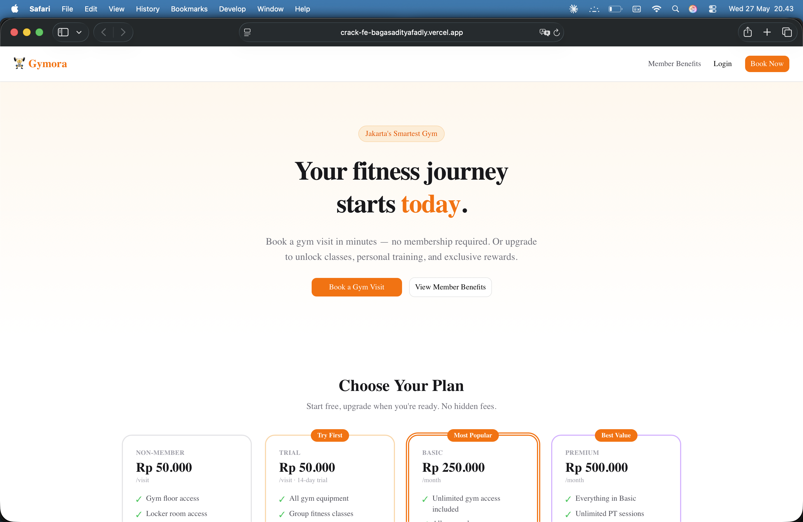
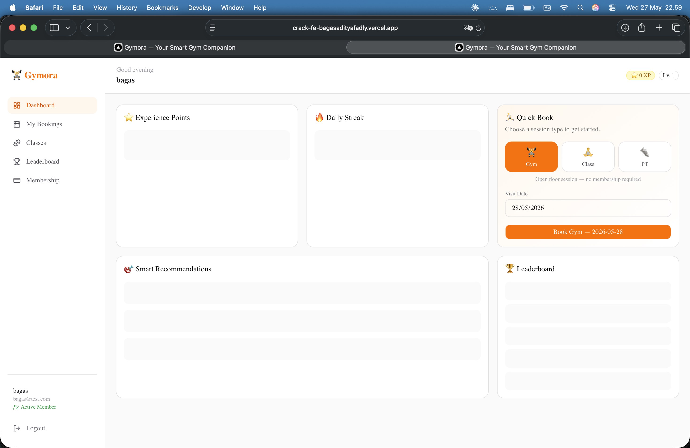
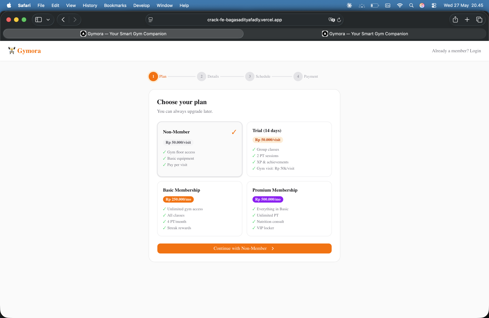
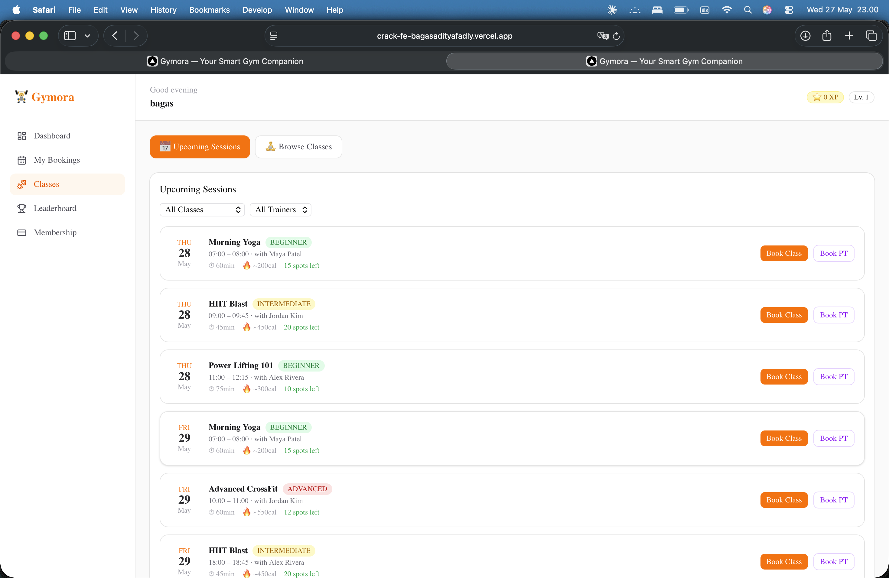
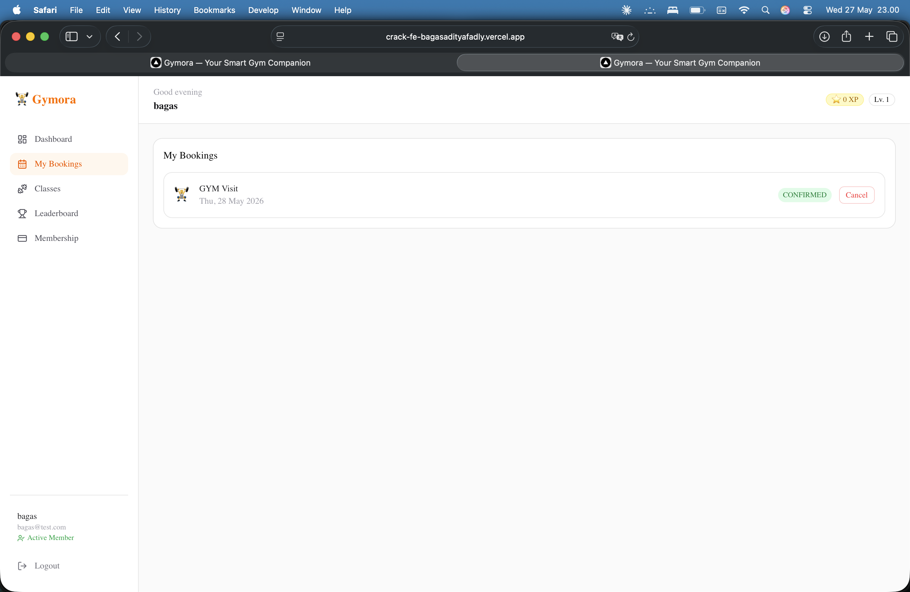
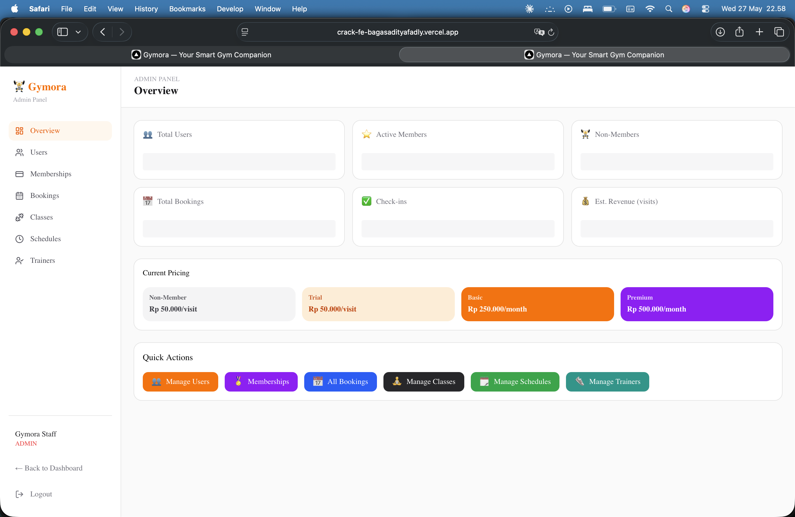

# 🏋 Gymora — Frontend

> Smart gym booking & management platform built with **Next.js 16** · **TypeScript** · **Tailwind CSS** · **Zustand**  
> Deployed on **Vercel**

[](https://nextjs.org)
[](https://react.dev)
[](https://typescriptlang.org)
[](https://tailwindcss.com)
[](https://vercel.com)

| | Link |
|---|---|
| 🌐 **Live Demo** | [https://crack-fe-bagasadityafadly.vercel.app](https://crack-fe-bagasadityafadly.vercel.app) |
| 🔗 **Backend API** | [https://crack-be-bagasadityafadly-1.onrender.com](https://crack-be-bagasadityafadly-1.onrender.com) |
| 📖 **API Docs (Swagger)** | [https://crack-be-bagasadityafadly-1.onrender.com/api/docs](https://crack-be-bagasadityafadly-1.onrender.com/api/docs)  |
| 💾 **Backend Repo** | [crack-be-bagasadityafadly](../crack-be-bagasadityafadly) |

---

## Table of Contents

1. [Overview](#overview)
2. [Tech Stack](#tech-stack)
3. [UI Screenshots](#ui-screenshots)
4. [Features by User Type](#features-by-user-type)
5. [Pricing Plans](#pricing-plans)
6. [Application Pages](#application-pages)
7. [Component Library](#component-library)
8. [State Management](#state-management)
9. [API Communication](#api-communication)
10. [Routing & Layout Groups](#routing--layout-groups)
11. [Authentication & Redirect Logic](#authentication--redirect-logic)
12. [Role-Based UI](#role-based-ui)
13. [Project Structure](#project-structure)
14. [Local Development](#local-development)
15. [Environment Variables](#environment-variables)
16. [Scripts](#scripts)
17. [Deployment](#deployment)
18. [Design Decisions](#design-decisions)
19. [Author](#author)

---

## Overview

Gymora is a full-stack gym management application. This repository contains the **frontend web app** — the interface that members, non-members, guests, and admins interact with.

It connects to the [Gymora Backend API](../crack-be-bagasadityafadly) for all data operations. The frontend handles:

- **Landing page** — plan comparison, benefit highlights, direct booking CTAs
- **Guest booking** — multi-step flow to book a gym visit without creating an account
- **Authentication** — register, login, forgot password, reset password
- **Member dashboard** — XP card, streak tracker, quick-book, personalised recommendations, leaderboard
- **Class browsing** — filter by class type, view schedules, book sessions with capacity indicator
- **Booking history** — list, filter by type/status, cancel bookings
- **Membership page** — view current plan, compare all plans, upgrade paths
- **Admin panel** — full CRUD for users, memberships, bookings, classes, schedules, trainers

---

## Tech Stack

| Layer | Technology | Version |
|---|---|---|
| Framework | Next.js (App Router) | 16.2.6 |
| Language | TypeScript | 5 |
| UI | React | 19.2.4 |
| Styling | Tailwind CSS | 4 |
| Component library | shadcn/ui (Radix UI primitives) | — |
| Animations | Framer Motion | 12 |
| State management | Zustand (with `persist` middleware) | 5 |
| Icons | Lucide React | 1.16 |
| QR code | react-qr-code (inline SVG, no external API) | 2.0 |
| HTTP client | Native `fetch` via `apiFetch` wrapper | — |
| Deployment | Vercel | — |

---

## UI Screenshots

<!-- ================================================================
     SCREENSHOT PLACEHOLDERS
     Recommended flow:
       1. mkdir -p docs
       2. Take screenshots of each page in the browser
       3. Save them as docs/ss-landing.png, docs/ss-dashboard.png, etc.
       4. Replace each placeholder img tag below
     ================================================================ -->

### Landing Page

*Public landing page with plan comparison and booking CTA.*

### Member Dashboard

*XP card, streak tracker, quick-book, recommendations, and leaderboard.*

### Guest Booking Flow

*5-step flow: choose plan → fill details → pick date/time → pay → QR code.*

### Classes & Schedules

*Browse class types and upcoming sessions with spots-left indicator.*

### Booking History

*List of all bookings with status badges and cancel action.*

### Admin Panel

*Overview stats and navigation to all management sections.*

---

## Features by User Type

### 🌐 Guest (not logged in)

| Feature | Details |
|---|---|
| Landing page | View platform overview, all 4 plans, and 6 benefit highlights |
| Member benefits | Full plan comparison table at `/benefits` |
| Guest booking | Book a gym visit without creating an account at `/book?plan=NONE` |
| QR entry code | Generated instantly after booking — shown inline, no external service |
| Register / Login CTAs | Available throughout the landing and booking flow |

### 🏋 Non-Member (logged in, no active plan)

| Feature | Details |
|---|---|
| Same dashboard layout as members | XP card, streak card, leaderboard visible |
| Non-member banner | Shows name, explains limitations, CTAs to book or upgrade |
| Gym visit booking | Works immediately — no membership required |
| Classes & PT | Clicking opens an **Upgrade Modal** instead of a booking form |
| Leaderboard | Fully visible |
| Membership page | Shows current status (`No active plan`) + all upgrade options |
| Sidebar | Shows "Become a Member" CTA |

### ⭐ Member (active TRIAL / BASIC / PREMIUM plan)

| Feature | Details |
|---|---|
| Full dashboard | XP card with progress bar, streak counter, personalised recommendations |
| Quick-book | GYM / CLASS / PT tabs with date picker directly on dashboard |
| Classes page | Browse class types + upcoming schedules; inline booking modal |
| Booking history | All bookings, cancel eligible ones |
| Membership page | Shows plan badge, expiry, days remaining, full feature list |
| Leaderboard | Full XP leaderboard |

### 🛡️ Admin (ADMIN role)

| Feature | Details |
|---|---|
| Admin sidebar | Overview, Users, Memberships, Bookings, Classes, Schedules, Trainers |
| Overview | 6-stat dashboard: total users, active members, non-members, bookings, check-ins, estimated revenue |
| User management | View all users, change role, assign membership plan, deactivate |
| Membership management | View active plans with days-left indicator, cancel |
| Booking management | Filter by status/type, update booking status |
| Class management | Create new class types, soft-delete |
| Schedule management | Create sessions (class + trainer + time + room), cancel |
| Trainer management | Add trainers, toggle active/inactive |
| Can also use member dashboard | Admin has full access to all member features |

---

## Pricing Plans

All four plans are available at sign-up and on the landing page:

| Plan | Price | Duration | What's included |
|---|---|---|---|
| **Non-Member** | Rp 50.000 | Per visit | Gym floor, locker room, basic equipment |
| **Trial** | Rp 50.000 | Per visit · 14-day access | Group classes, 2 PT sessions, XP system |
| **Basic** | Rp 250.000 | Per month | Unlimited gym + all classes + 4 PT/month + streaks |
| **Premium** | Rp 500.000 | Per month | Everything in Basic + unlimited PT + nutrition + VIP locker |

> No plan is free. Even the Trial and Non-Member visits are charged Rp 50.000 per visit (payment is simulated in demo mode).

---

## Application Pages

All pages are under `src/app/` using the Next.js App Router with three route groups.

---

### Public Pages — `(auth)` group

These pages are accessible without logging in.

#### `/` — Landing Page
- Sticky navigation bar with Login and Book Now CTAs
- Hero section with headline and "Book Your First Visit" button
- 6 benefit highlights (Group Classes, Personal Training, XP & Achievements, Booking, Streak Rewards, Progress Tracking)
- 4 plan cards side by side with pricing, features, and per-plan booking links
- Footer with quick links to login, register, and benefits

#### `/login` — Login
- Email + password form with inline field validation
- Shows specific error for wrong password, locked email hint for banned accounts
- Forgot password link → `/forgot-password`
- Role-based redirect on success: `ADMIN` → `/admin`, others → `/dashboard`
- **"Book Now Without Login"** card below the form — entry point for guest booking
  - 4 benefit pills: Free entry, QR code ticket, No membership, 2-min setup
  - "Book Now Without Login →" → `/book?plan=NONE`
  - "Start a free 14-day trial" → `/book?plan=TRIAL`

#### `/register` — Register
- Name, email, password fields with validation
- Password strength indicator (uppercase + lowercase + number required)
- Role-based redirect on success (same as login)

#### `/forgot-password` — Forgot Password
- Email input, sends reset request to `POST /auth/forgot-password`
- Demo mode: displays the reset token on screen for testing

#### `/reset-password` — Reset Password
- Token + new password fields
- Validates password strength before submitting

#### `/benefits` — Member Benefits Comparison
- Full feature comparison table across all 4 plans
- Tick/cross icons for every feature per plan
- CTA button per plan linking to the booking flow

#### `/book` — Guest Booking Flow
5-step flow driven by `?plan=NONE|TRIAL|BASIC|PREMIUM` query param:

| Step | Name | What happens |
|---|---|---|
| 1 | **Choose Plan** | 4 plan cards, user selects one |
| 2 | **Your Details** | Name (always), email (optional for NONE plan), password (only if email entered), phone (optional) |
| 3 | **Pick Schedule** | Date picker (min: tomorrow) + 13 time-slot grid (06:00–20:00) |
| 4 | **Review & Pay** | Order summary — plan, date, arrival time, total. Payment method chips (demo). Membership upsell block shown for NONE plan. |
| 5 | **Done — QR Code** | Booking confirmed. QR code generated inline (react-qr-code SVG). Anonymous users see a "save screenshot" warning. Registered users get a dashboard link. |

**Guest booking paths handled internally:**
- Anonymous (no email) → throwaway account, QR only, no JWT stored
- Register (new email+password) → account created, JWT stored, redirect available
- Login (existing email+password) → JWT stored, dashboard available

---

### Member Dashboard Pages — `(dashboard)` group

Protected: redirects to `/login` if no JWT token is found in Zustand store.

#### `/dashboard` — Dashboard Home
- **Non-member banner** (only for `NON_MEMBER` role): welcome message + "Book Gym Visit" and "Upgrade Plan →" buttons
- **XP Card** — total XP, current level (1 per 100 XP), progress bar to next level, full XP history list
- **Streak Card** — current streak count in days, last check-in date, motivation message
- **Quick Book Card** — tabbed (GYM / CLASS / PT); CLASS and PT tabs show 🔒 lock for NON_MEMBER and open Upgrade Modal; GYM tab shows date picker and Book button
- **Recommendation Widget** — personalised class suggestions from API based on body assessment; nudge to complete assessment if none exists
- **Leaderboard Card** — top 10 users by XP with rank, name, level, and streak

#### `/classes` — Classes & Schedules
- View toggle: **Classes** (catalogue) or **Schedules** (upcoming sessions)
- Difficulty badges: BEGINNER (green), INTERMEDIATE (yellow), ADVANCED (red)
- Class cards: name, difficulty, duration, calorie estimate, description, "View Schedules" link
- Schedule cards: class name + trainer + date/time + room + spots remaining bar
- NON_MEMBER: "Join to Book" opens Upgrade Modal instead of booking form
- MEMBER: Inline **booking modal** — confirms class/trainer/time, submits `POST /bookings`

#### `/bookings` — My Bookings
- Lists all user bookings ordered by date (newest first)
- Type icon: 🏋 GYM · 🧘 CLASS · 👟 PT
- Status badge: CONFIRMED (green) / PENDING (yellow) / CANCELLED (grey) / COMPLETED (blue) / NO_SHOW (red)
- Shows class name, trainer, room, date/time for CLASS and PT bookings
- **Cancel button** — shown for PENDING/CONFIRMED bookings with future dates; calls `PATCH /bookings/:id/cancel`

#### `/leaderboard` — Full Leaderboard
- Full XP leaderboard with all users
- Rank number, name, XP total, level, streak count
- Highlights the current user's row

#### `/membership` — Membership
- Shows current plan status: type, expiry date, days remaining (red if ≤ 7 days)
- `No active plan` state for NON_MEMBER
- 3 plan upgrade cards (TRIAL / BASIC / PREMIUM) with feature lists and "Upgrade" links → `/book?plan=TYPE`

---

### Admin Panel Pages — `(admin)` group

Protected: redirects to `/login` if not authenticated; redirects to `/dashboard` if role is not `ADMIN`.

#### `/admin` — Overview
- 6 stat cards: Total Users, Active Members, Non-Members, Total Bookings, Check-ins, Estimated Revenue (IDR formatted)
- Pricing reference card (all 4 plans and rates)
- 6 coloured quick-action buttons linking to each management section

#### `/admin/users` — User Management
- Table of all users: name, email, role badge, booking count, membership type, join date
- **Change Role** dropdown: ADMIN / MEMBER / NON_MEMBER → `PATCH /admin/users/:id/role`
- **Assign Membership** button → modal with plan type + duration picker → `POST /admin/users/:id/membership`
- **Deactivate** button → `PATCH /admin/users/:id/deactivate`

#### `/admin/memberships` — Membership Management
- Summary cards: TRIAL / BASIC / PREMIUM counts with pricing reminder
- Filter chips by plan type
- Table: user name, email, plan badge, start date, end date, days remaining (red ≤ 7)
- **Cancel** button with confirmation dialog → `DELETE /admin/memberships/:id`
  - Auto-downgrades user role to NON_MEMBER if no plans remain

#### `/admin/bookings` — Booking Management
- Filter chips by status: ALL / PENDING / CONFIRMED / CANCELLED / COMPLETED / NO_SHOW (with counts)
- Type filter dropdown: ALL / GYM / CLASS / PT
- Table: user, type icon, class name, status badge, date, actions
- Contextual action buttons (only valid transitions shown):
  - PENDING → Confirm / Cancel
  - CONFIRMED → Complete / Mark No-Show / Cancel
- Calls `PATCH /admin/bookings/:id/status`

#### `/admin/classes` — Class Management
- Grid of existing classes with difficulty, duration, capacity, calorie estimate
- **Add Class form**: name, description, difficulty, duration (min), capacity, calories
- **Delete** (soft) button → `DELETE /admin/classes/:id`

#### `/admin/schedules` — Schedule Management
- Table of upcoming active schedules: class, trainer, date/time, room, booked/capacity
- **Add Schedule form**: class dropdown, trainer dropdown, start/end datetime, room
- **Cancel session** button → `DELETE /admin/schedules/:id`

#### `/admin/trainers` — Trainer Management
- Trainer cards: name, specialty, session count badge, active status
- **Add Trainer form**: name (required), email (required), specialty, bio
- **Deactivate / Reactivate** toggle button → `PATCH /admin/trainers/:id`

---

## Component Library

### Dashboard Components (`src/components/dashboard/`)

| Component | File | Description |
|---|---|---|
| `XpCard` | `XpCard.tsx` | Displays XP total, current level, progress bar (XP % in current level), XP history list |
| `StreakCard` | `StreakCard.tsx` | Shows streak count in days, last check-in date, motivational message |
| `QuickBookCard` | `QuickBookCard.tsx` | Tabbed GYM/CLASS/PT quick-book. CLASS and PT open UpgradeModal for NON_MEMBER. GYM has date picker + time slots + submit |
| `RecommendationWidget` | `RecommendationWidget.tsx` | Fetches and renders personalised class suggestions, recovery advice, and active challenge from `/recommendations/me` |
| `LeaderboardCard` | `LeaderboardCard.tsx` | Shows top-10 XP leaderboard. Highlights current user. |

### Layout Components (`src/components/layout/`)

| Component | File | Description |
|---|---|---|
| `Sidebar` | `Sidebar.tsx` | Left navigation for member dashboard. Nav items: Dashboard, My Bookings, Classes, Leaderboard, Membership. Shows "Become a Member" for NON_MEMBER. Shows Admin link for ADMIN. |
| `Topbar` | `Topbar.tsx` | Top bar shown inside dashboard pages. Displays user name, role badge, and logout button. |

### UI Components (`src/components/ui/`)

| Component | Description |
|---|---|
| `UpgradeModal` | Shown when NON_MEMBER clicks a members-only feature. Explains what they're missing, offers "Upgrade Plan" and "Book Free Gym Visit" CTAs. Closes on backdrop click or ✕. |
| `Button` | shadcn/ui button with variants: default, outline, ghost, destructive |
| `Card` / `CardHeader` / `CardContent` / `CardTitle` | shadcn/ui card layout primitives |
| `Badge` | Coloured inline label (used for booking status, difficulty, role) |
| `Avatar` | Circular avatar with fallback initials |
| `Separator` | Horizontal or vertical divider line |

---

## State Management

Zustand is used for global auth state with localStorage persistence.

### Auth Store (`src/store/auth.store.ts`)

```typescript
interface AuthStore {
  token: string | null;       // JWT access token
  user: User | null;          // { id, email, name, role }
  _hasHydrated: boolean;      // true once localStorage has been read
  login(token, user): void;   // store token + user after successful auth
  logout(): void;             // clear token + user, call before redirect to /login
  updateUser(patch): void;    // partial user update (e.g. after role change)
  setHasHydrated(v): void;    // called by onRehydrateStorage callback
}
```

**Persistence:** The store is persisted to `localStorage` under the key `gymora-auth` using Zustand's `persist` middleware.

**Hydration guard:** Because Next.js renders pages on the server (where `localStorage` is unavailable), the `_hasHydrated` flag prevents rendering protected content before the store has loaded from storage. All protected layouts check this flag:

```typescript
// In every protected layout:
if (!_hasHydrated) return null;   // wait for localStorage to load
if (!token)        return null;   // redirect handled in useEffect
```

**Token storage in API calls:** `apiFetch` reads the token directly from `useAuthStore.getState().token` (outside React) so it works in non-component contexts without subscribing.

---

## API Communication

All API requests go through a single `apiFetch` helper (`src/lib/api.ts`).

```typescript
export async function apiFetch<T = unknown>(
  path: string,
  options?: RequestInit,
): Promise<T>
```

What it does automatically:
1. Prepends `NEXT_PUBLIC_API_URL` (defaults to `http://localhost:3000/api/v1`)
2. Reads the JWT token from the Zustand store and adds `Authorization: Bearer <token>`
3. Sets `Content-Type: application/json`
4. Awaits the response JSON
5. If `!res.ok` → throws `Error(data.message)` — caught in each page's `try/catch`
6. If `res.ok` → unwraps the backend envelope (`data.data`) and returns the inner payload

```typescript
// Usage example
const xp = await apiFetch<UserXp>('/xp/my');

// With options
const booking = await apiFetch<Booking>('/bookings', {
  method: 'POST',
  body: JSON.stringify({ type: 'GYM', bookingDate: '2026-06-01T09:00:00Z' }),
});
```

---

## Routing & Layout Groups

Next.js App Router route groups are used to apply different layouts to different sections without affecting the URL:

```
src/app/
├── page.tsx                   → /             (Landing, no layout wrapper)
├── (auth)/                    → No shared layout — each page is standalone
│   ├── login/page.tsx         → /login
│   ├── register/page.tsx      → /register
│   ├── forgot-password/       → /forgot-password
│   ├── reset-password/        → /reset-password
│   ├── benefits/page.tsx      → /benefits
│   └── book/page.tsx          → /book
├── (dashboard)/               → DashboardLayout: Sidebar + auth guard
│   ├── dashboard/page.tsx     → /dashboard
│   ├── classes/page.tsx       → /classes
│   ├── bookings/page.tsx      → /bookings
│   ├── leaderboard/page.tsx   → /leaderboard
│   └── membership/page.tsx    → /membership
└── (admin)/                   → AdminLayout: Admin sidebar + ADMIN role guard
    └── admin/
        ├── page.tsx           → /admin
        ├── users/page.tsx     → /admin/users
        ├── memberships/       → /admin/memberships
        ├── bookings/          → /admin/bookings
        ├── classes/           → /admin/classes
        ├── schedules/         → /admin/schedules
        └── trainers/          → /admin/trainers
```

---

## Authentication & Redirect Logic

### Login flow

```
POST /auth/login
       │
       ▼
  success? ──No──► show "Invalid credentials" error
       │
      Yes
       │
       ▼
  loginStore(token, user)    ← token + user stored in Zustand + localStorage
       │
       ▼
  user.role === 'ADMIN'?
  ├── Yes → router.push('/admin')
  └── No  → router.push('/dashboard')
```

### Protected layout guard

```
DashboardLayout mounts
       │
       ▼
  _hasHydrated?  ──No──► render null (wait)
       │
      Yes
       │
  token exists?  ──No──► router.replace('/login')
       │
      Yes
       │
  render children (Sidebar + page)
```

### Admin layout guard (additional role check)

```
AdminLayout mounts
       │
  _hasHydrated + token + role === 'ADMIN'?
  ├── Not hydrated yet    → render null
  ├── No token            → router.replace('/login')
  ├── Wrong role          → router.replace('/dashboard')
  └── All pass            → render admin sidebar + children
```

### Logout flow

```
User clicks "Logout"
       │
  logout()          ← clears Zustand store + localStorage
       │
  router.push('/login')
```

---

## Role-Based UI

The frontend adapts its interface based on `user.role` from the Zustand store:

| UI element | `NON_MEMBER` | `MEMBER` | `ADMIN` |
|---|---|---|---|
| Non-member banner on dashboard | ✅ shown | ❌ hidden | ❌ hidden |
| Quick-book CLASS/PT tabs | 🔒 opens UpgradeModal | ✅ works | ✅ works |
| Classes page "Join to Book" | 🔒 opens UpgradeModal | ✅ booking modal | ✅ booking modal |
| Sidebar "Become a Member" link | ✅ shown | ❌ hidden | ❌ hidden |
| Sidebar Admin link | ❌ hidden | ❌ hidden | ✅ shown (red) |
| `/admin/*` routes | ❌ redirected to `/dashboard` | ❌ redirected to `/dashboard` | ✅ accessible |
| Membership page status | "No active plan" | Plan badge + expiry | Plan badge + expiry |

---

## Project Structure

```
crack-fe-bagasadityafadly/
├── docs/
│   ├── ss-landing.png         # ← Place landing page screenshot here
│   ├── ss-dashboard.png       # ← Place dashboard screenshot here
│   ├── ss-booking.png         # ← Place booking flow screenshot here
│   ├── ss-classes.png         # ← Place classes page screenshot here
│   ├── ss-bookings.png        # ← Place bookings page screenshot here
│   └── ss-admin.png           # ← Place admin panel screenshot here
├── public/                    # Static assets
├── src/
│   ├── app/
│   │   ├── layout.tsx         # Root layout — font, global CSS
│   │   ├── page.tsx           # Landing page (/)
│   │   ├── (auth)/            # Unauthenticated pages (no shared layout)
│   │   │   ├── login/
│   │   │   ├── register/
│   │   │   ├── forgot-password/
│   │   │   ├── reset-password/
│   │   │   ├── benefits/
│   │   │   └── book/          # 5-step guest booking flow with QR output
│   │   ├── (dashboard)/       # Member area (Sidebar layout + auth guard)
│   │   │   ├── layout.tsx     # Auth guard → /login if no token
│   │   │   ├── dashboard/     # XP, streak, quick-book, recommendations, leaderboard
│   │   │   ├── classes/       # Class catalogue + schedule list + booking modal
│   │   │   ├── bookings/      # Booking history with cancel action
│   │   │   ├── leaderboard/   # Full XP leaderboard
│   │   │   └── membership/    # Plan status + upgrade options
│   │   └── (admin)/           # Admin area (Admin sidebar + ADMIN role guard)
│   │       ├── layout.tsx     # Redirects non-ADMIN to /dashboard
│   │       └── admin/
│   │           ├── page.tsx           # Overview stats + quick links
│   │           ├── users/             # User list, role change, membership assign
│   │           ├── memberships/       # Active memberships, cancel
│   │           ├── bookings/          # All bookings, status filter, status update
│   │           ├── classes/           # Class list, create, soft-delete
│   │           ├── schedules/         # Schedule list, create, cancel
│   │           └── trainers/          # Trainer list, add, toggle active
│   ├── components/
│   │   ├── dashboard/
│   │   │   ├── XpCard.tsx             # XP total, level, progress bar, history
│   │   │   ├── StreakCard.tsx          # Streak counter and last check-in
│   │   │   ├── QuickBookCard.tsx      # GYM/CLASS/PT tabs, date/time picker
│   │   │   ├── RecommendationWidget.tsx # Personalised class suggestions
│   │   │   └── LeaderboardCard.tsx    # Top-10 XP leaderboard
│   │   ├── layout/
│   │   │   ├── Sidebar.tsx            # Member nav: 5 links + admin/member CTAs
│   │   │   └── Topbar.tsx             # User name, role badge, logout button
│   │   └── ui/
│   │       ├── UpgradeModal.tsx       # Membership gate modal for NON_MEMBER
│   │       ├── button.tsx             # shadcn Button
│   │       ├── card.tsx               # shadcn Card primitives
│   │       ├── badge.tsx              # shadcn Badge
│   │       ├── avatar.tsx             # shadcn Avatar
│   │       └── separator.tsx          # shadcn Separator
│   ├── lib/
│   │   ├── api.ts                     # apiFetch: token injection + envelope unwrap
│   │   └── utils.ts                   # cn() helper (clsx + tailwind-merge)
│   ├── store/
│   │   └── auth.store.ts              # Zustand store: token, user, hydration flag
│   └── types/
│       └── index.ts                   # Shared TypeScript interfaces for all entities
├── .env.local                         # Local environment variables (git-ignored)
├── .env.example                       # Template for environment setup
├── .npmrc                             # loglevel=error (suppresses npm warnings)
├── next.config.ts                     # Next.js configuration
├── tailwind.config.ts                 # Tailwind configuration
├── tsconfig.json                      # TypeScript configuration
└── vercel.json                        # Vercel deployment settings
```

---

## Local Development

### Prerequisites

- **Node.js** 18 or higher
- **Backend API** running locally or pointed to the deployed Render URL

### Setup

```bash
# 1. Clone the repository
git clone https://github.com/Revou-FSSE-Oct25/crack-fe-bagasadityafadly.git
cd crack-fe-bagasadityafadly

# 2. Install dependencies
npm install

# 3. Create your local environment file
cp .env.example .env.local

# 4. Edit .env.local (see Environment Variables section)

# 5. Start the development server (runs on port 3002)
npm run dev
```

Open [http://localhost:3002](http://localhost:3002) in your browser.

> **Tip:** If you want to run the backend locally at the same time, start it on port `3000` (its default) and set `NEXT_PUBLIC_API_URL=http://localhost:3000/api/v1` in `.env.local`.

### Quick start with the deployed backend

If you only want to work on the frontend and don't need a local backend:

```bash
# .env.local
NEXT_PUBLIC_API_URL=https://gymora-api.onrender.com/api/v1
NEXT_PUBLIC_APP_NAME=Gymora
```

### Default accounts (after backend seeding)

| Role | Email | Password |
|---|---|---|
| Admin | `admin@gymora.com` | `Admin123!` |
| Member | `member@gymora.com` | `Member123!` |

---

## Environment Variables

| Variable | Required | Default | Description |
|---|---|---|---|
| `NEXT_PUBLIC_API_URL` | ✅ | `http://localhost:3000/api/v1` | Base URL for all API calls. Must include `/api/v1`. The `NEXT_PUBLIC_` prefix makes it available in the browser. |
| `NEXT_PUBLIC_APP_NAME` | | `Gymora` | App display name used in page titles and meta tags. |

### `.env.example` template

```dotenv
# Backend API URL
# Local backend:
NEXT_PUBLIC_API_URL=http://localhost:3000/api/v1

# Or point to the deployed Render backend:
# NEXT_PUBLIC_API_URL=https://gymora-api.onrender.com/api/v1

# App name
NEXT_PUBLIC_APP_NAME=Gymora
```

> ⚠️ `.env.local` is in `.gitignore` and must never be committed. Set production values directly in the Vercel dashboard.

---

## Scripts

```bash
npm run dev      # Start dev server on http://localhost:3002 (hot reload)
npm run build    # Build optimised production bundle
npm run start    # Serve the production build locally
npm run lint     # ESLint check across all TypeScript files
```

---

## Deployment

This app is deployed on **Vercel** (connected to the GitHub repository).

### Vercel configuration (`vercel.json`)

```json
{
  "framework": "nextjs",
  "buildCommand": "npm run build",
  "devCommand": "npm run dev",
  "installCommand": "npm install"
}
```

### Environment variable to set in Vercel dashboard

| Variable | Value |
|---|---|
| `NEXT_PUBLIC_API_URL` | `https://gymora-api.onrender.com/api/v1` |
| `NEXT_PUBLIC_APP_NAME` | `Gymora` |

### Deploy your own instance

```bash
# 1. Fork this repository on GitHub

# 2. Go to https://vercel.com → New Project → Import from GitHub

# 3. Set environment variables in the Vercel dashboard:
#    NEXT_PUBLIC_API_URL = https://your-render-api.onrender.com/api/v1

# 4. Deploy — Vercel auto-deploys on every push to main
```

### How auto-deployment works

Every `git push` to the `main` branch triggers a Vercel build automatically. Vercel runs `npm run build`, generates static + server-side assets, and publishes within ~1 minute.

---

## Design Decisions

### 1. Route Groups for Layout Isolation

Next.js App Router route groups (`(auth)`, `(dashboard)`, `(admin)`) let each section have its own layout — Sidebar for members, Admin sidebar for admins, no shared layout for auth pages — without those group names appearing in the URL.

### 2. Zustand with Hydration Guard

`localStorage` is unavailable during server-side rendering. Without a hydration guard, protected pages would flash their content before checking the token. The `_hasHydrated` flag solves this: layouts render `null` until `onRehydrateStorage` fires, ensuring the token check always happens with real data.

### 3. Single `apiFetch` Wrapper

Instead of calling `fetch` directly in each component, all API calls go through `apiFetch`. This centralises three concerns: base URL configuration, JWT header injection, and response envelope unwrapping (`data.data`). Changing any of these only requires editing one file.

### 4. UpgradeModal Instead of Redirects

When a `NON_MEMBER` clicks a gated feature (Classes, PT), instead of redirecting to an error page, an `UpgradeModal` appears in-place. This keeps the user in context, explains what they'd get by upgrading, and offers two clear paths (Upgrade Plan or Book Free Visit).

### 5. Local QR Code Generation

The booking confirmation QR code is generated using `react-qr-code` which produces an inline SVG. No external image API (like `api.qrserver.com`) is called — the QR renders instantly, works offline, and is never blocked by CORS or network issues.

### 6. `Suspense` for `useSearchParams`

The `/book` page uses `useSearchParams()` to read the `?plan=` query parameter. Next.js requires components using `useSearchParams` to be wrapped in `<Suspense>` to avoid hydration errors. The `BookFlow` component is wrapped and shows a spinner fallback.

### 7. Soft-delete Everywhere

Deactivating users, cancelling classes, and cancelling schedules all use soft-delete (`isActive = false`) rather than hard-delete. This preserves historical booking data and allows admins to recover records if needed.

---

## Related

| | |
|---|---|
| **Backend repo** | [crack-be-bagasadityafadly](../crack-be-bagasadityafadly) — NestJS + Prisma + PostgreSQL |
| **API Docs** | [https://gymora-api.onrender.com/api/docs](https://gymora-api.onrender.com/api/docs) |
| **Database** | Supabase — PostgreSQL 15 |
| **Backend hosting** | Render (free tier) |

---

## Author

**Bagas Aditya Fadly** — Built for RevoU Crack Assignment  
GitHub: [@Revou-FSSE-Oct25](https://github.com/Revou-FSSE-Oct25)
